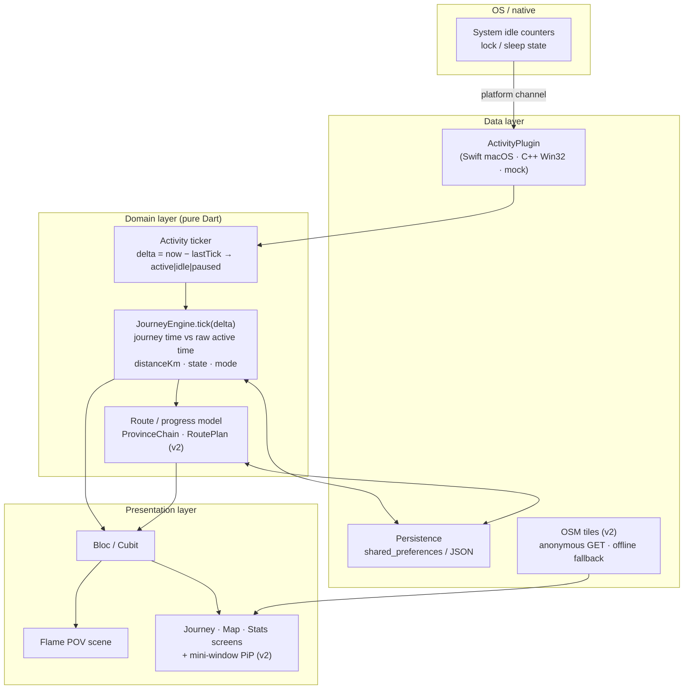

# System overview diagram

Component + data-flow picture of Vietnam Focus Journey (Clean Architecture layers).
Renders on GitHub. Keep in sync with [../overview.md](../overview.md); the prose there is authoritative.

**Key invariants shown:** the engine is pure Dart with an injected clock + `ActivityPlugin` (deterministic,
testable); distance comes from journey time while stats come from raw active time (BR-6); the only network
egress is anonymous OSM tiles (BR-11).
